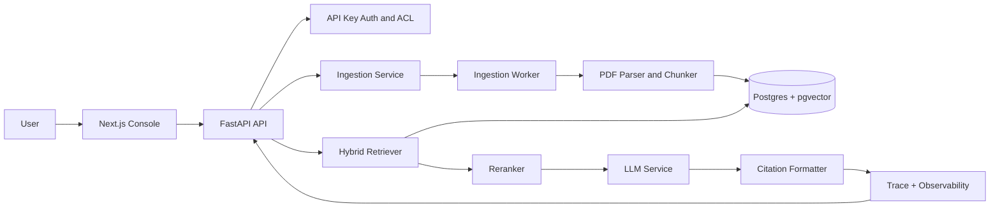

# TraceRAG

Production-focused RAG platform for document ingestion, hybrid retrieval, citation-grounded answers, trace inspection, and evaluation-driven quality checks.

## Live Demo

- Frontend: `Coming soon - deploy frontend/ to Vercel`
- Backend API: `Coming soon - deploy FastAPI service to Render, Railway, or Cloud Run`
- Local API docs: `http://localhost:8000/docs`

## Problem

Most RAG demos answer questions without enough evidence for production use. Teams need to know which documents were retrieved, why an answer was generated, whether citations are present, and whether quality checks pass before the system is trusted.

TraceRAG focuses on the production layer around RAG: ingestion jobs, hybrid retrieval, access control, source citations, traces, readiness checks, and eval gates.

## Features

- PDF ingestion with durable ingestion-job tracking.
- Hybrid retrieval using vector search and keyword search.
- Citation-backed answer generation with source snippets.
- Query trace endpoint for retrieval results, citations, latency, and metadata.
- Document-level access control through API key user/group mappings.
- Local deterministic mode for smoke tests and CI.
- Production path with Postgres, pgvector, Redis rate limiting, S3-compatible storage, and OpenAI.
- Evaluation runner with golden QA examples.
- Backend tests, CI, Docker, production compose, runbook, and release checklist.
- Next.js operator console for upload, chat, settings, and trace inspection.

## Architecture



## Tech Stack

| Layer | Tools |
| --- | --- |
| Backend | FastAPI, SQLAlchemy, Alembic, Pydantic |
| Retrieval | pgvector, Postgres full-text search, local reranker |
| LLM | OpenAI in production, deterministic local mode for tests |
| Frontend | Next.js, TypeScript, Tailwind CSS |
| Storage | Local filesystem for development, S3-compatible object storage for production |
| Reliability | Redis rate limiting, readiness checks, structured errors, pytest, GitHub Actions |
| Deployment | Docker, Docker Compose, Vercel-ready frontend |

## Project Structure

```text
trace-rag-system/
├── app/                  # FastAPI app, services, schemas, models, worker
├── alembic/              # Database migrations
├── evals/                # Golden QA eval runner and sample dataset
├── frontend/             # Next.js console
├── scripts/              # Local setup helpers
├── tests/                # Backend tests and production-readiness checks
├── docker-compose.yml    # Local services
├── docker-compose.prod.yml
├── DEPLOYMENT.md
├── RUNBOOK.md
└── SECURITY.md
```

## Setup

### Backend

```bash
python -m venv .venv
source .venv/bin/activate
pip install -r requirements-dev.txt
cp .env.example .env
docker compose up -d postgres redis
alembic upgrade head
uvicorn app.main:app --reload
```

In a second terminal, run the ingestion worker:

```bash
python -m app.workers.ingestion_worker
```

### Frontend

```bash
cd frontend
npm install
cp .env.example .env.local
npm run dev
```

## Environment Variables

Use `.env.example` as the source of truth. Important production variables:

| Variable | Purpose |
| --- | --- |
| `APP_ENV` | `local`, `test`, or `production` |
| `DATABASE_URL` | Postgres/pgvector connection string |
| `OPENAI_API_KEY` | Required for production embeddings and answers |
| `ADMIN_API_KEYS` | Admin API keys for ingestion and privileged actions |
| `USER_API_KEYS` | User/group API key mappings for ACL checks |
| `STORAGE_BACKEND` | `local` or `s3` |
| `S3_BUCKET` | Object storage bucket when using S3-compatible storage |
| `RATE_LIMIT_BACKEND` | `memory` locally, `redis` in production |
| `REDIS_URL` | Redis URL for production rate limiting |

## Usage and API Examples

Health:

```bash
curl http://localhost:8000/api/v1/health
curl http://localhost:8000/api/v1/health/ready
```

Ingest a document:

```bash
curl -X POST http://localhost:8000/api/v1/documents/ingest \
  -H "X-API-Key: dev-admin-key" \
  -F "file=@sample.pdf"
```

Check ingestion status:

```bash
curl http://localhost:8000/api/v1/ingestion-jobs/<job_id> \
  -H "X-API-Key: dev-admin-key"
```

Ask a grounded question:

```bash
curl -X POST http://localhost:8000/api/v1/query \
  -H "Content-Type: application/json" \
  -H "X-API-Key: dev-user-key" \
  -d '{"question":"What are the key policy constraints?","top_k":6}'
```

Inspect a trace:

```bash
curl http://localhost:8000/api/v1/query/<query_log_id>/trace \
  -H "X-API-Key: dev-user-key"
```

## RAG Approach

1. Uploaded PDFs are parsed and chunked with stable metadata.
2. Chunks are stored with vector embeddings and searchable text.
3. Query time retrieval combines semantic similarity with keyword search.
4. Candidate chunks are reranked before the answer is generated.
5. Answers include citations tied back to retrieved chunks.
6. Trace logs preserve retrieval, citation, and latency metadata for review.

## Evaluation

The repo includes `evals/golden_qa.example.jsonl` and `evals/run_eval.py` for repeatable quality checks. The current checks focus on:

- Retrieval quality: whether relevant chunks appear in the candidate set.
- Faithfulness: whether answers stay grounded in retrieved context.
- Citation coverage: whether responses include usable source references.
- Latency: endpoint and service-level timing captured in query metadata.

Run:

```bash
python -m pytest
python evals/run_eval.py --dataset evals/golden_qa.example.jsonl
```

## Deployment

Recommended split:

- Frontend: Vercel, using `frontend/` as the project root.
- Backend: Render, Railway, or Cloud Run using the root Dockerfile.
- Database: Neon or Supabase Postgres with pgvector.
- Cache: Upstash Redis.
- Object storage: S3, Cloudflare R2, or compatible storage.

See `DEPLOYMENT.md` for environment variables, health checks, migration flow, backup, and rollback notes.

## Roadmap

- Hosted public demo with a seeded sample document set.
- Frontend CI build/typecheck gate.
- Admin dashboard for eval history and failed-query review.
- Optional Langfuse/OpenTelemetry tracing export.
- Multi-tenant document collections.

## Author

Yash Sharma - MCA AI/ML student building production-oriented RAG, NLP, and backend AI systems.
